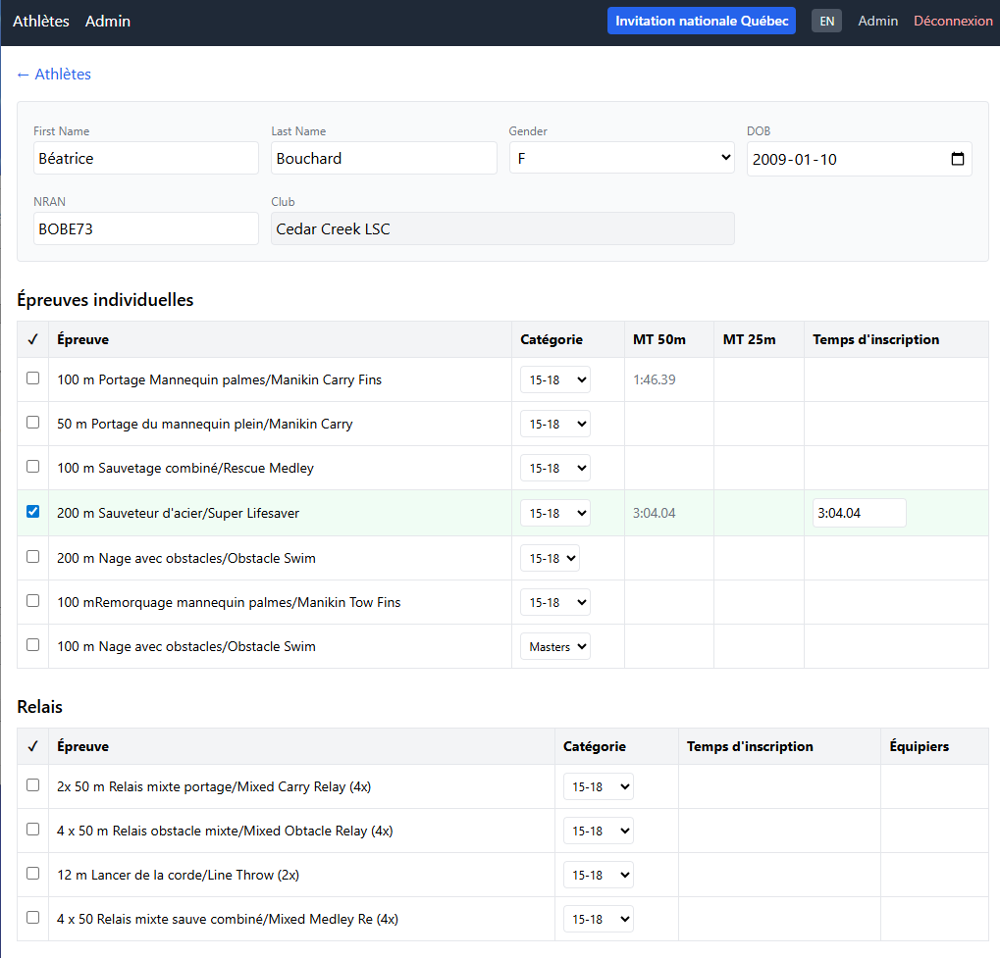
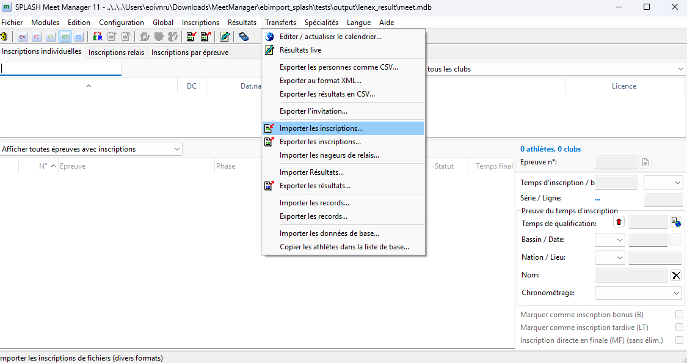

# Meet Manager — Quick Start Workflow

## Prerequisites

- SPLASH Meet Manager 11
- Meet Manager App running (Docker)
- Admin access to the app (admin PIN)

---

## Step 1 — Admin: Set Up Clubs and Athletes

1. Log in to Meet Manager App as **Admin**
2. In the **Admin** page, upload a Lenex entries `.lxf` file (previous meet or master list) to import clubs, athletes, and best times
3. Review the club list; add or remove clubs as needed
4. Designate the **organizer club** under *Set Meet Organizer*

---

## Step 2 — Organizer: Get the Meet Template

1. Log in as the **Organizer** (club designated by Admin)
2. In the **Organizer** page, click **Download Meet Template (.lxf)**
3. Open the downloaded `.lxf` file in SPLASH — this restores the previous meet structure as a starting point
4. In SPLASH, update the meet: dates, sessions, events, fees, and any other details

---

## Step 3 — Export the Meet Invitation from SPLASH

1. In SPLASH, go to **Transfers → Export invitation…**
2. Save the resulting `.lxf` file (this is your updated meet structure)

---

## Step 4 — Organizer: Upload the Meet Structure

1. In the **Organizer** page, click **Upload Meet Structure** and select the `.lxf` exported in Step 3
2. The app loads all events, pool size, masters flag, and fees
3. The **Fee Summary** box will show the loaded meet-level and per-event fees

---

## Step 5 — Organizer: Set the Entry Closure Date

1. In the **Organizer** page, set the **Entry closure date**
2. Club coaches can register until this date; the invite list greys out after closure

---

## Step 6 — Organizer: Send Invitations to Club Coaches

1. In the **Organizer** page, go to **Team Invites**
2. Select the clubs to invite (use the checkboxes or select all)
3. Click **Send Invitation** — each coach receives an email with a one-time secure link to retrieve their club PIN

---

## Step 7 — Club Coaches Register Athletes

1. Coach clicks the PIN link in the invitation email to reveal their club PIN
2. Coach logs in with the PIN
3. Select an athlete → Registration page opens
4. Check events to register; select category (15-18 / Open / Masters)
5. Best times (50m and 25m) are shown read-only
6. Entry time is pre-filled from the best time matching the meet's pool size; adjust if needed

---

## Step 8 — Organizer: Export Registrations

1. After the closure date, in the **Organizer** page click **Download bundle (.zip)**
2. The zip contains the registrations `.lxf` and SPLASH simulation helper scripts

---

## Step 9 — Import Entries into SPLASH

1. In SPLASH, go to **Transfers → Import entries…**
2. Select the `.lxf` from inside the downloaded zip
3. All athletes, clubs, and entry times are imported and ready for race day

---

## Step 10 — After the Meet: Export Results from SPLASH

1. After the competition, in SPLASH go to **Transfers → Export results…**
2. Save the results `.lxf` file

---

## Step 11 — Admin: Upload Results to Update Best Times

1. In the **Admin** page, upload the results `.lxf` under **Upload Lenex (.lxf)**
2. Best times are updated (fastest of entry time vs. result, per pool size)
3. These times will pre-fill entry times for the next meet

---

## Step 12 — Admin: Export the Updated Entries File

1. In the **Data Management** page, click **Download entries (.lxf)**
2. Save this file — use it as the seed for the next meet (Step 1)

---

## Summary

| Step | Action | Who | Tool |
|------|--------|-----|------|
| 1 | Import clubs & athletes; designate organizer | Admin | Meet Manager App |
| 2 | Download meet template | Organizer | Meet Manager App |
| 3 | Update meet in SPLASH; export invitation | Organizer | SPLASH |
| 4 | Upload meet structure | Organizer | Meet Manager App |
| 5 | Set closure date | Organizer | Meet Manager App |
| 6 | Send invitations | Organizer | Meet Manager App |
| 7 | Register athletes | Club coaches | Meet Manager App |
| 8 | Export registrations bundle (.zip) | Organizer | Meet Manager App |
| 9 | Import entries | Organizer | SPLASH |
| 10 | Export results | — | SPLASH |
| 11 | Upload results / update best times | Admin | Meet Manager App |
| 12 | Export updated entries file | Admin | Meet Manager App |
