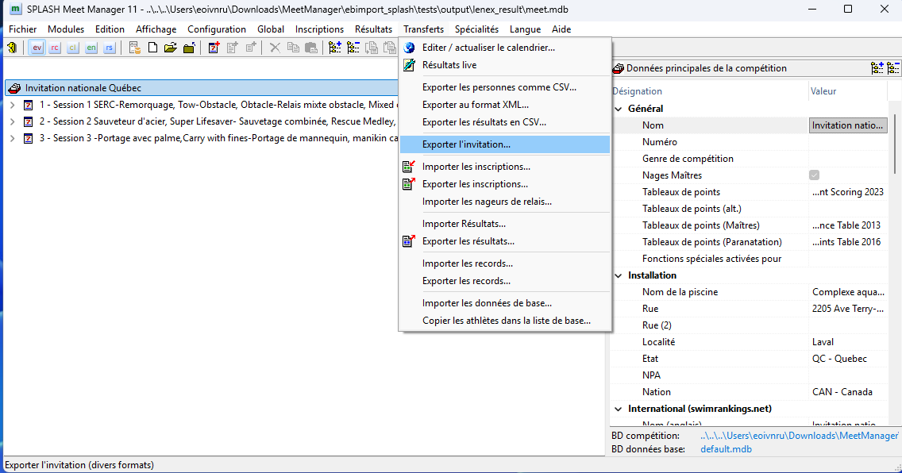
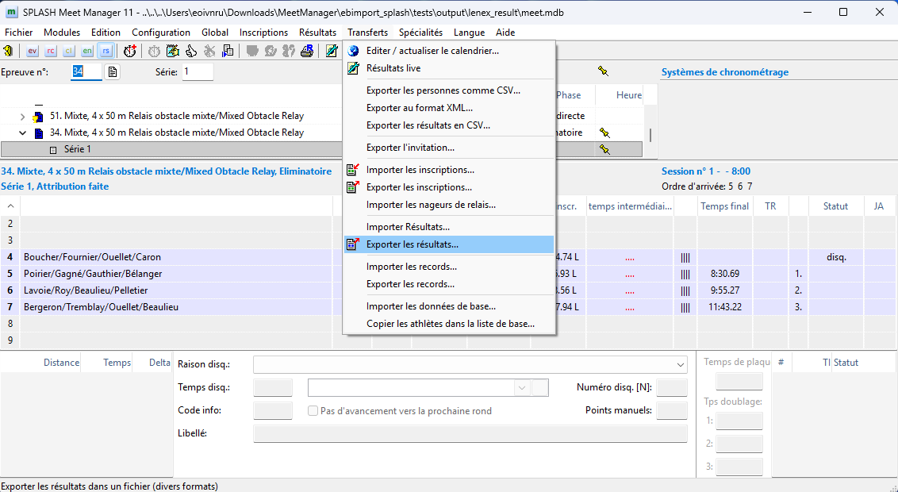

# Meet Manager — Guide rapide du flux de travail

## Prérequis

- SPLASH Meet Manager 11 avec votre base de données de compétition (`.mdb`)
- Application Meet Manager en marche (Docker)
- Fichier .lxf de la compétition exporté depuis SPLASH

---

## Étape 1 — Exporter l'invitation depuis SPLASH

1. Ouvrir votre compétition dans SPLASH Meet Manager
2. Aller dans **Transferts → Exporter l'invitation...**
3. Sauvegarder le fichier `.lxf` (c'est la structure de la compétition)

---

## Étape 2 — Téléverser la structure dans Meet Manager App

1. Se connecter à l'application Meet Manager en tant qu'**Admin** (NIP admin)
2. Dans la page **Admin**, téléverser le fichier `.lxf` sous **Téléverser compétition**
3. L'application charge toutes les épreuves, la taille du bassin et le drapeau Masters

---

## Étape 3 — Envoyer les invitations aux responsables d'équipe

1. Dans la page Admin, défiler jusqu'à **Invitations d'équipe**
2. Entrer le courriel de chaque responsable d'équipe
3. Cliquer **Envoyer NIP** — un courriel est envoyé avec un lien sécurisé à usage unique vers leur NIP

---

## Étape 4 — Les responsables d'équipe inscrivent les athlètes

1. Le responsable se connecte avec le NIP de son club
2. Sélectionner un athlète → la page d'inscription s'ouvre
3. Cocher les épreuves, sélectionner la catégorie (15-18 / Open / Masters)
4. Les meilleurs temps (50m et 25m) sont affichés en lecture seule
5. Le temps d'inscription est pré-rempli à partir du meilleur temps correspondant au bassin
6. Ajuster le temps d'inscription si nécessaire

---

## Étape 5 — L'admin exporte les inscriptions

1. Dans la page Admin, cliquer **Télécharger .lxf** sous Exporter
2. Sauvegarder le fichier `.lxf` généré

---

## Étape 6 — Importer les inscriptions dans SPLASH

1. Dans SPLASH, aller dans **Transferts → Importer les inscriptions...**
2. Sélectionner le fichier `.lxf` exporté depuis Meet Manager App
3. Tous les athlètes, clubs et temps d'inscription sont importés

---

## Étape 7 — Après la compétition : Exporter les résultats

1. Après la compétition, dans SPLASH aller dans **Transferts → Exporter les résultats...**
2. Sauvegarder le fichier `.lxf` des résultats

---

## Étape 8 — Téléverser les résultats pour mettre à jour les meilleurs temps

1. Dans la page Admin, téléverser le fichier `.lxf` des résultats sous **Téléverser résultats**
2. Les meilleurs temps sont mis à jour (le plus rapide entre le temps d'inscription et le résultat, par taille de bassin)
3. Ces meilleurs temps pré-rempliront les temps d'inscription pour la prochaine compétition

---

## Résumé

| Étape | Action | Outil |
|-------|--------|-------|
| 1 | Exporter l'invitation | SPLASH |
| 2 | Téléverser la structure | Meet Manager App (Admin) |
| 3 | Envoyer les invitations | Meet Manager App (Admin) |
| 4 | Inscrire les athlètes | Meet Manager App (Responsable) |
| 5 | Exporter les inscriptions | Meet Manager App (Admin) |
| 6 | Importer les inscriptions | SPLASH |
| 7 | Exporter les résultats | SPLASH |
| 8 | Téléverser résultats / meilleurs temps | Meet Manager App (Admin) |
